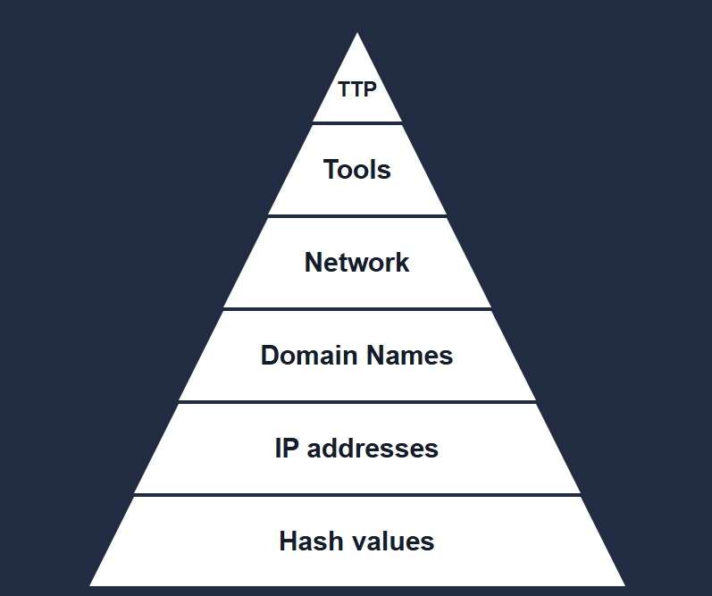
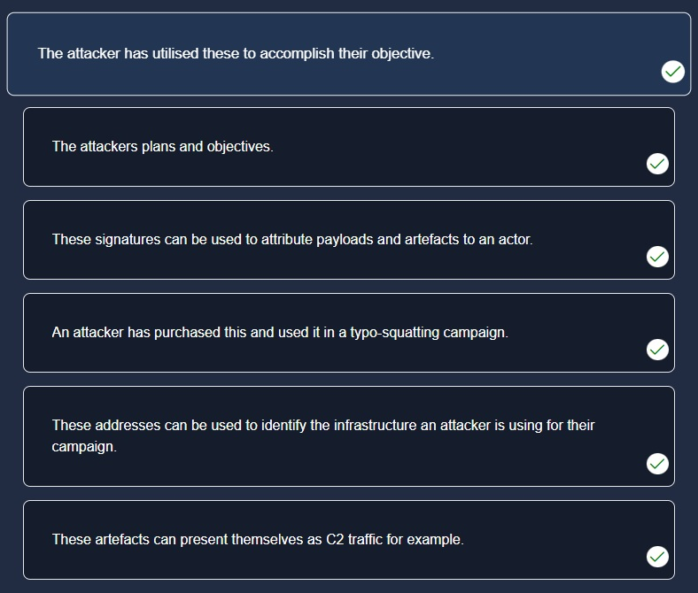
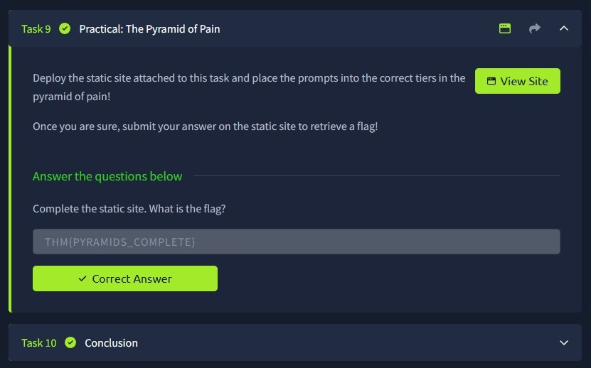

# Portefólio de Cibersegurança - Projetos Autónomos

Bem-vindo ao meu portefólio. Este espaço é dedicado à documentação de laboratórios práticos e cenários reais resolvidos durante o meu percurso de especialização em Cibersegurança.

---

## Projeto 1: Análise e Classificação de Indicadores de Compromisso (IoCs) com a Pyramid of Pain

### 1. Introdução e Objetivo
Como futuro Analista de SOC (Security Operations Center), compreender a eficácia das defesas de uma infraestrutura é fundamental. Este projeto demonstra a aplicação prática do conceito da **Pyramid of Pain (Pirâmide da Dor)**, focado em entender o impacto e a "dor" que causamos a um cibercriminoso ao bloquear diferentes tipos de Indicadores de Compromisso (IoCs).

O objetivo principal foi analisar cenários práticos e categorizar os artefactos deixados por um atacante de acordo com o nível de dificuldade que ele enfrentará para contornar as nossas defesas.

---

### 2. O Conceito Técnico
A pirâmide está dividida em 6 camadas. Quanto mais alto subimos na pirâmide, mais difícil e dispendioso é para o atacante alterar o seu comportamento, tornando a nossa deteção muito mais robusta:

* **Hash Values (Trivial):** Assinaturas únicas de ficheiros (MD5, SHA-256). Mudar um único bit no ficheiro altera o hash.
* **IP Addresses (Easy):** Endereços de rede. O atacante pode mudar de IP facilmente usando VPNs ou proxies.
* **Domain Names (Simple):** Nomes de domínio (ex: `malicious-site.com`). Exige registo, mas continua a ser simples de alterar.
* **Network/Host Artifacts (Annoying):** Rastros na rede (User-Agents) ou no sistema operativo (chaves de registo). Dá trabalho ao atacante modificar.
* **Tools (Challenging):** Software usado para o ataque (ex: Mimikatz, Nmap). Obriga o atacante a reconfigurar ou programar ferramentas novas.
* **TTPs (Tough):** Táticas, Técnicas e Procedimentos. O comportamento/metodologia do atacante. Mudar as TTPs obriga o adversário a reaprender o seu próprio *modus operandi*.

 

 

---

### 3. Resolução do Caso Prático
Utilizando o ambiente laboratorial simulado do TryHackMe, foi necessário analisar seis descrições de comportamentos e infraestruturas de um atacante para associá-las corretamente aos níveis correspondentes da pirâmide. 

A análise baseou-se nos seguintes critérios:
1. Identificação de assinaturas e artefactos específicos de campanhas de *typo-squatting* (Domínios).
2. Associação de tráfego de Comando e Controlo (C2) a artefactos de rede.
3. Mapeamento dos planos gerais do adversário diretamente ao nível de TTPs (o topo da pirâmide).

 

 

Após a correta distribuição de todos os vetores e prompts no simulador, o desafio foi concluído com sucesso, gerando a assinatura de validação técnica (*flag*) do laboratório.

 

 

---

### 4. Conclusão e Mitigação no Mundo Real
A conclusão deste laboratório reforça que uma defesa de SOC moderna não pode depender apenas de listas de IPs ou Hashes conhecidos (a base da pirâmide), pois são fáceis de contornar. 

Para criar resiliência a longo prazo, as equipas de Blue Team devem focar-se na criação de regras de deteção baseadas em **TTPs** e **Ferramentas** (recorrendo a frameworks como o MITRE ATT&CK), garantindo que, mesmo que o atacante mude de infraestrutura, o seu comportamento suspeito seja detetado e bloqueado imediatamente.

---

## Projeto 2: Mapeamento de Fases de Ataque com a Unified Kill Chain

### 1. Introdução e Objetivo
Neste segundo projeto, o foco foi compreender a ordem cronológica e as metodologias estruturadas que os atacantes utilizam para comprometer sistemas corporativos. Utilizando a framework moderna **Unified Kill Chain**, analisei as táticas adversárias divididas de forma estratégica para além do perímetro defensivo tradicional.

O objetivo foi entender como mapear as ações de um atacante em cenários complexos de persistência e movimentação interna, aplicando os conceitos chave de Defesa Ativa.

---

### 2. O Conceito Técnico
Ao contrário dos modelos lineares antigos, a **Unified Kill Chain** adapta-se aos ambientes modernos dividindo um ataque em **18 fases** agrupadas em 3 grandes blocos operacionais:
* **In (Entrar):** Reconhecimento, desenvolvimento de recursos e obtenção do primeiro ponto de acesso.
* **Through (Navegar):** Ações críticas dentro da rede, incluindo elevação de privilégios, evasão de defesas e movimentação lateral.
* **Out (Executar):** A fase de impacto final (exfiltração de dados confidenciais ou execução de Ransomware).

Esta abordagem adota a mentalidade de **"Assumir a Invasão" (Assume Breach)**, permitindo à equipa do SOC detetar o adversário mesmo que as defesas perimetrais falhem.

---

### 3. Resolução do Caso Prático
A análise laboratorial envolveu a decomposição de um ataque cibernético simulado através do cruzamento de matrizes de inteligência. O exercício prático exigiu a identificação de logs associados a fases de exploração inicial, o rastreamento de ações de *pivoting* e a correta categorização do incidente em conformidade com o fluxo dinâmico da Unified Kill Chain.

---

### 4. Conclusão e Mitigação no Mundo Real
A aplicação da Unified Kill Chain no dia a dia de um Analista de SOC permite estruturar a resposta a incidentes de forma granular. Se compreendermos que o atacante está na fase de "Movimentação Lateral", as regras de mitigação automatizadas (SOAR) podem isolar o segmento de rede afetado imediatamente, impedindo que o incidente progrida para a exfiltração ou destruição de dados.

---
## Projeto 3: Engenharia de Deteção com MITRE ATT&CK e MITRE CAR

### 1. Introdução e Objetivo
O objetivo deste projeto foi dominar a framework **MITRE ATT&CK** e o repositório **MITRE CAR (Cyber Analytics Repository)** para analisar o comportamento de grupos de ameaças persistentes avançadas (APTs) e traduzir esse conhecimento em regras de monitorização práticas para um ambiente de SOC.

---

### 2. O Conceito Técnico
* **MITRE ATT&CK:** Uma base de dados global que cataloga táticas (os objetivos do hacker) e técnicas (como ele executa esses objetivos) baseada em observações do mundo real.
* **MITRE CAR:** Um repositório complementar que fornece lógicas de deteção e *queries* prontas (Splunk, EQL) baseadas no modelo ATT&CK, servindo como a "ficha técnica" para criar alertas de segurança.

---

### 3. Resolução do Caso Prático
Durante o laboratório prático, foram analisados cenários operacionais de grupos reais:
1. **Mapeamento do Grupo APT33 (Elfin):** Investigação de como o grupo utiliza credenciais de e-mail comprometidas e manipula a ferramenta legítima **Ruler** para criar regras maliciosas ocultas no Microsoft Exchange, garantindo persistência persistente.
2. **Análise do Grupo Mustang Panda (G0129):** Estudo técnico do arsenal do grupo, focado em campanhas de *Spear-phishing*, uso de ferramentas nativas do sistema (LOLBins como PowerShell e curl.exe) e execução do backdoor **PlugX** através de técnicas de *DLL Side-Loading*.
3. **Desenvolvimento de Deteções (CAR-2020-09-001):** Análise de lógicas de deteção para monitorizar a criação e modificação de ficheiros no Agendador de Tarefas do Windows (`C:\Windows\Tasks`), visando mitigar ataques de persistência.

---

### 4. Conclusão e Mitigação no Mundo Real
Mapear alertas com base no MITRE ATT&CK eleva a maturidade de um SOC. Em vez de depender apenas de indicadores simples (como hashes de vírus conhecidos), a equipa de defesa passa a monitorizar o comportamento do atacante. Ferramentas como o **Ruler** ou táticas do **Mustang Panda** provam que a monitorização de processos filhos anómalos (ex: Outlook a iniciar o PowerShell) é crucial para mitigar invasões antes do impacto final.

